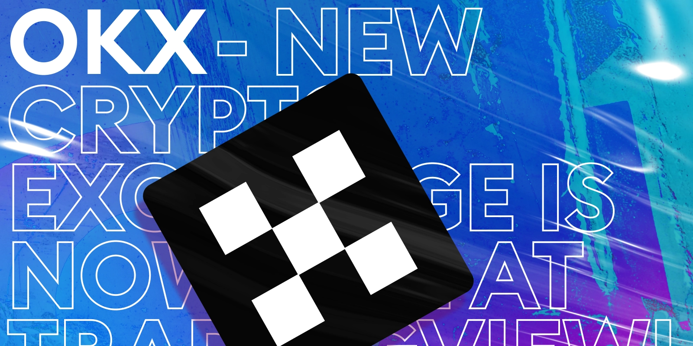
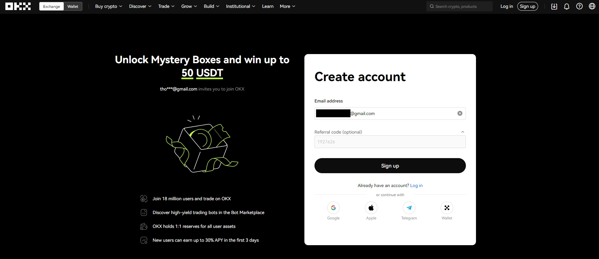
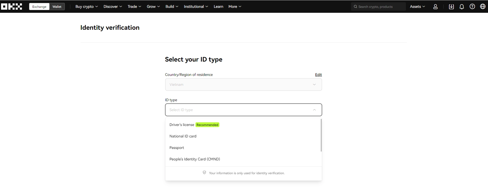
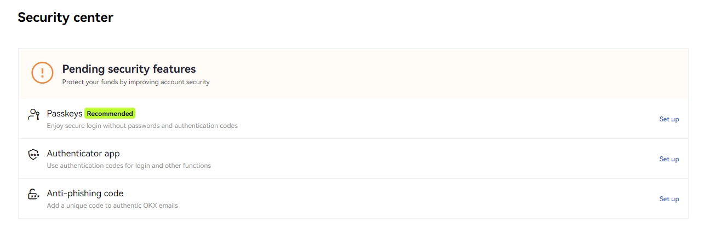
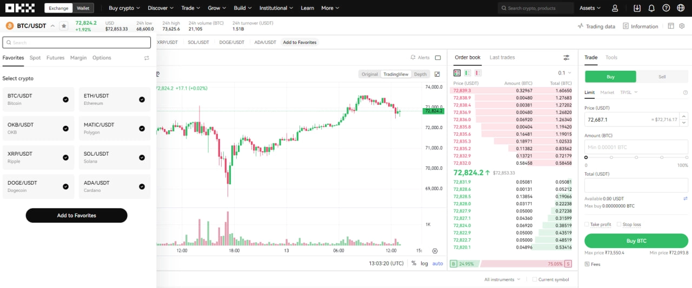
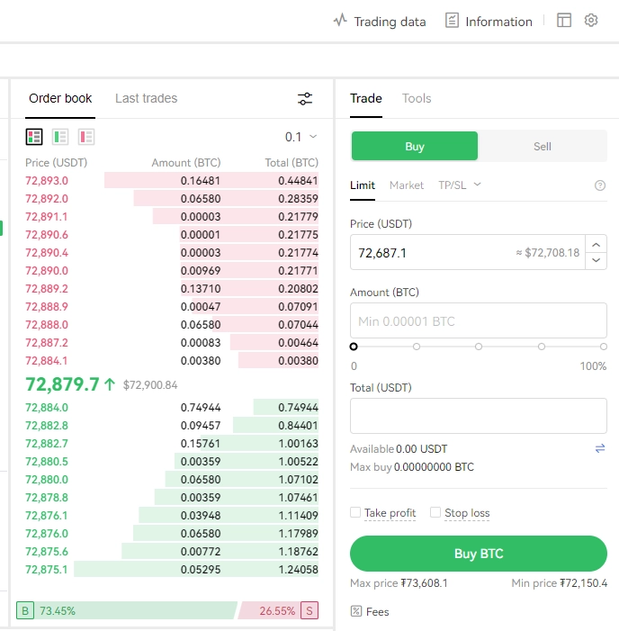

# OKX交易所全面解析：注册、交易与安全操作指南

加密货币市场日益火热,选对交易平台成了投资者的头等大事。OKX作为全球顶尖的数字资产交易所之一,凭借丰富的产品线、强大的流动性和完善的安全机制,吸引了数百万用户。但很多新手不知道如何入门——从注册账户到完成第一笔交易,每个环节都需要谨慎对待。本文将手把手教你如何在OKX上开启你的加密货币投资之旅,让你快速掌握平台核心功能,避开常见坑点。

---

## OKX交易所是什么?为何值得信赖

OKX成立于2014年,总部位于香港,是全球交易量排名前列的加密货币交易所。这不是一个普通的买卖平台那么简单——它更像是一个完整的数字金融生态系统。你可以在这里进行现货交易、合约交易,也可以通过质押和借贷让闲置资产生息,甚至能参与NFT交易和Web3游戏。

平台背后有Giant Network Group、Longling Capital等知名风投机构的支持,这意味着它不会是那种突然就跑路的野鸡平台。OKX在安全性上也下了功夫:冷钱包存储、多重签名、实时风控系统,这些措施让用户资产得到多层保护。

对于中文用户来说,OKX的一大优势是支持P2P交易,可以直接用人民币或越南盾等法币购买USDT等稳定币,免去了复杂的出入金流程。而且平台界面简洁,无论是新手还是专业交易员,都能快速上手。

👉 [立即注册OKX,领取专属新手福利](https://www.okx.com/join/62834398)

## OKX核心产品:不只是买卖加密货币

OKX的产品线覆盖了加密货币交易的各个层面,从基础的现货交易到复杂的衍生品,再到被动收益产品,应有尽有。

### 现货交易:最直接的投资方式

现货交易就是直接买卖加密货币。你花100美元买比特币,比特币就真实属于你。OKX支持数百种主流币和山寨币的现货交易,交易界面提供实时K线图、深度图和各类技术指标,帮你做出更准确的判断。

订单类型也很灵活:市价单可以立即成交,限价单让你设定心理价位慢慢等,止损单则能在行情不利时自动帮你止损。这些工具组合使用,能大幅提升交易效率。

### 衍生品交易:放大收益与风险

如果你想用小资金博取大收益,衍生品交易是个选择——当然,风险也会成倍放大。OKX提供期货合约、永续合约和期权交易。

永续合约特别受欢迎,因为它没有到期日,可以一直持仓。通过杠杆,你可以用1000美元的本金控制价值10000美元甚至更多的仓位。但要记住,杠杆是双刃剑,行情反向波动时亏损也会被放大。

### 理财产品:让闲钱生息

不想频繁交易?OKX Earn提供了多种被动收益方案。活期储蓄可以随存随取,定期储蓄收益更高但有锁定期。质押(Staking)是另一种选择,通过支持区块链网络运行来获得奖励。

这些产品的年化收益率从几个百分点到十几个百分点不等,比传统银行存款高多了。当然,收益越高风险通常也越大,选择前要仔细评估。

### P2P交易:法币与加密货币的桥梁

P2P交易让你可以直接和其他用户买卖加密货币,用本地货币支付。对于那些银行卡不方便直接购买加密货币的地区,这是最实用的入金渠道。OKX作为中间平台提供托管服务,确保交易双方的资金安全。

## 注册OKX账户:3分钟完成开户

注册过程很简单,但有几个细节需要注意。

首先,确保你访问的是OKX官方网站,别点进钓鱼网站把账号密码泄露了。建议直接使用这个[官方注册链接](https://www.okx.com/join/62834398),可以享受新用户专属优惠。

点击"Sign Up"后,选择用邮箱注册(比手机号更方便后续验证)。输入邮箱后,系统会发送一个6位验证码,60秒内输入就行。接着需要绑定手机号,同样会收到验证码。

然后是设置密码。别用"123456"这种弱密码,最好是大小写字母、数字和符号的组合,至少12位。记住,密码是你资产安全的第一道防线,OKX的客服永远不会问你要密码。

最后填写个人信息。这里要填真实信息,因为后续做身份验证(KYC)时会用到,填错了会很麻烦。

## 身份验证(KYC):为什么必须完成它

很多人觉得KYC很烦,但这是保护你资产的关键步骤。

### KYC的重要性

OKX的KYC分三个等级。没验证?抱歉,你一分钱都取不出来。完成基础验证,每天可以提现相当于0.5个比特币的额度。完成高级验证,额度提升到每天100个比特币。

除了提现额度,KYC还能提升账户安全性。一个实名认证的账户被盗用的可能性要低得多,因为黑客很难通过你的人脸识别和证件验证。

### 如何完成KYC

登录后点击个人头像,选择"Verification"。你可以用身份证、护照或驾照进行验证。上传证件照片时注意光线要充足,四角都要拍清楚,不能有反光。

然后是人脸识别,按照提示对着摄像头做几个动作就行。整个过程大概5分钟,提交后等审核,一般几个小时到一天就能通过。

有个重要提醒:**一定要保存好"Setup key"(设置密钥)**。这是你丢失手机或无法使用Google Authenticator时恢复账户的唯一途径。把它抄在纸上或存在安全的地方,别存在手机或电脑里——设备丢了这些信息也就丢了。

## 双重验证(2FA):给账户上双保险

密码再复杂,也抵不过黑客的攻击工具。这时候2FA(双因素验证)就派上用场了。

### 设置Google Authenticator

在"Security"菜单里找到"Authenticator App",点击设置。如果手机上没装Google Authenticator,先去应用商店下载。

打开Authenticator,扫描OKX显示的二维码。这时App会生成一个6位数字的动态密码,每30秒刷新一次。把这个密码输入OKX完成绑定。

**再次强调**:一定要保存二维码或Setup key!手机丢了、换了手机、App卸载了,没有这个密钥你就进不去账户了。

### 短信验证作为补充

除了Google Authenticator,建议同时开启短信验证。这样即使Authenticator App出了问题,你还有短信验证这条备用通道。

每次登录、提现或修改重要设置时,OKX都会要求你输入2FA验证码。虽然多了一步操作,但安全性提升了不止一个档次。

## 充币到OKX:第一步别选错网络

注册好账户,下一步就是往里充钱了。这个环节最容易出错的地方是**选错网络**,导致资产永久丢失。

### 充值步骤详解

点击"Assets"(资产),选择"Deposit"(充值)。在币种列表里选你要充的币,比如USDT。

接下来是关键:**选择网络**。USDT可以在多个区块链网络上转账,常见的有TRC20、ERC20、BSC等。你必须确保OKX上选择的网络和你发送方(钱包或其他交易所)使用的网络一致。

比如你从另一个交易所通过TRC20网络发送USDT,那在OKX这边也必须选TRC20。选错了,钱就石沉大海了,找不回来。

选好网络后,OKX会显示充值地址和二维码。复制地址或扫码,到发送方粘贴这个地址,输入金额,确认发送。

### 提现到其他钱包

提现流程类似,同样要注意网络选择。点击"Withdraw",选币种,选网络,粘贴你的钱包地址,输入提现数量。

提现前会要求输入2FA验证码,确认无误后提交。根据区块链网络拥堵程度,到账时间从几分钟到几小时不等。

有个小技巧:第一次给新地址提现时,先转一小笔测试,确认能到账后再转大额。多花点手续费总比丢币强。

## 现货交易实操:从入门到盈利

充好币,就可以开始交易了。但先别急着下单,有个前置步骤要做。

### 资金划转:从储蓄账户到交易账户

你充进OKX的币默认在"Funding Account"(储蓄账户)里,要交易必须先划转到"Trading Account"(交易账户)。

点击"Assets" → "My assets" → "Transfer",选择从Funding转到Trading,选币种,输入金额,确认。这个操作是即时的,划转完就能交易。

### 下单交易

进入"Trade" → "Spot"交易界面。左边是币种列表,搜索你想买的币对,比如BTC/USDT。

右下角是下单区域,有三种常用订单:

- **市价单**:按当前市场价立即成交,适合急着买入或卖出的情况
- **限价单**:设定一个价格,等市场价到达时自动成交,适合有明确目标价的交易
- **止损单**:防止亏损扩大的保命工具,价格跌到设定值时自动卖出

对新手来说,限价单是最好的选择。它让你有时间思考,不会因为市场波动被迫接受不利价格。

输入你的买入价格和数量,点击"Buy"。订单会显示在"Open Orders"里,成交后会出现在"Order History"。

## P2P交易:用本地货币快速入金

如果你手里只有法币,P2P是最直接的入金方式。

### 购买USDT

点击"Buy crypto" → "P2P trading"。页面会显示各个卖家的报价、交易笔数和完成率。

选一个价格合理、完成率高的卖家,点"Buy"。输入你想买的USDT数量,系统会显示需要支付的金额。

确认后,卖家的银行账户信息会显示出来。你需要在规定时间内(通常15分钟)转账给卖家,备注按要求填写。

转账后回到OKX,点击"已转账"。卖家确认收款后,USDT就会到你的账户。整个过程OKX会托管币,保证交易安全。

### 出售USDT换回法币

切换到"Sell"标签,选买家,输入要卖的数量。订单生成后,你的USDT会被锁定,等买家付款。

**这里最关键**:收到买家付款通知后,**一定要先登录自己的银行账户确认钱真的到了**,再回到OKX点击"Release"放币。有些骗子会发假的转账截图,你一放币钱就没了。

---

## 总结

OKX作为全球领先的加密货币交易所,提供了从基础交易到高级金融产品的完整服务。注册简单,但KYC和2FA这两个安全措施必须认真对待——它们是保护你资产的最后防线。充值提现时谨慎选择网络,P2P交易时注意防骗,现货交易从小额开始练手。

掌握这些基础操作后,你就能在OKX上自如地进行交易了。但别忘了,加密货币市场波动大,风险高,永远只投入你能承受损失的资金。从学习和实践中积累经验,才能在这个市场长久生存下去。

想开始你的加密货币之旅?👉 [点击注册OKX,使用邀请码62834398享受手续费优惠](https://www.okx.com/join/62834398)
